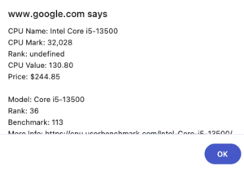

# cpu-passmark-lookup-chrome-extension

Simple extension to lookup a CPUs Passmark via highlight -> Right Click -> Lookup CPU Information

## Installation

- Go to chrome://extensions
- Load Unpacked
- Select src/ folder in this repo

## Usage

Highlight a CPU name in your browser anywhere e.g.: "Intel Core i5-13500" and right click -> "Lookup CPU Information"

You should receive a popup/alert giving you the CPU information.

## Updating CPU information

Run the python script cpu_benchmark_scrape.py to update the cpu_benchmark.json.

### Roadmap

- Better fuzzy matching
- Better User Benchmark dataset matching so you see those too
- Usage of popup or hover since Javascript alert() is blocking

#### Icon

Icon was generated with DALL-E, then resized using online resizer.